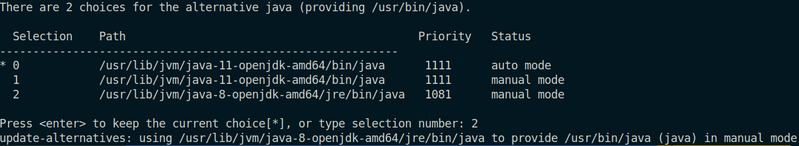
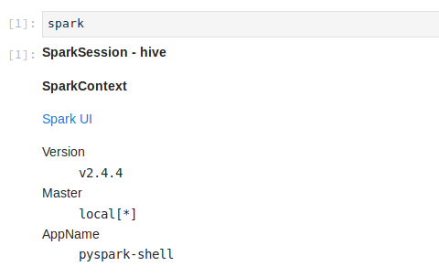

# Aula de Spark (04/11)

## Notebooks

### Demo

* `demo_jupyter_kernel_python.ipynb`: sobre como usar Spark dentro de um kernel Python.

* `demo_pandas_vs_spark.ipynb`: sobre como o Spark têm performance inferior quando usado para processar um dataset pequeno.

### Exercícios

A seguinte ordem é sugerida para fazer os exercícios:

* `exercicio_acoes_transformacoes.ipynb`: sobre a diferença entre transformações e ações.

* `exercicio_livros_populares.ipynb`: sobre um pipeline de processamento de dados para selecionar os livros mais populares. Têm exemplos de uso de Spark SQL e DataFrame API.

* `exercicio_spark_udfs.ipynb`: mostra exemplos simples de construção de user-defined-functions (`udf`s).

* `exercicio_tags_co_ocorrentes.ipynb`: sobre um pipeline de processamento de dados para mostrar quais tags co-correm mais. Têm exemplos de joins e uso de `udf`s. 

## Instalação do Spark

Atenção :warning:: Instruções válidas para sistema operacional Ubuntu 18.04. Podem haver variações para outros sistemas.

```bash
sudo apt-get install openjdk-8-jdk-headless -qq > /dev/null
wget -q http://www-eu.apache.org/dist/spark/spark-2.4.4/spark-2.4.4-bin-hadoop2.7.tgz
sudo mv spark-2.4.4-bin-hadoop2.7 /opt
```

Adicionar ao arquivo `~/.bashrc`:
```bash
export PATH=$PATH:/opt/spark-2.4.4-bin-hadoop2.7/bin
export SPARK_HOME=/opt/spark-2.4.4-bin-hadoop2.7
```

Em seguida, recarregar as configurações recém inseridas com o comando: `source ~/.bashrc`.

De acordo com a [documentação atual](https://spark.apache.org/docs/latest/), Spark roda usando a versão 8 do Java. 

Caso você tenha uma versão do Java mais nova já instalada (você pode checar executando o comando `java -version`), rode o comando `sudo update-alternatives --config java` e selecione a versão correta. Aparecerá algo assim:



## Instalação do kernel pyspark para uso no `jupyter notebook`

Instale a biblioteca para python `pyspark` na mesma versão que o Spark:
```bash
pip install pyspark==2.4.4
```

Crie um arquivo que conterá a configuração do seu kernel, com o seguinte conteúdo:
```
{
 "display_name": "pyspark-kernel",
 "language": "python",
 "argv": [
  "<PATH_TO_PYTHON>",
  "-m",
  "IPython.kernel",
  "-f",
  "{connection_file}"
 ],
 "env": {
  "SPARK_HOME": "/opt/spark-2.4.4-bin-hadoop2.7",
  "PYTHONPATH": "<PATH_TO_PYTHON>:/opt/spark-2.4.4-bin-hadoop2.7/python/lib/py4j-2.4.4-src.zip",
  "PYTHONSTARTUP": "/opt/spark-2.4.4-bin-hadoop2.7/python/pyspark/shell.py",
  "PYSPARK_SUBMIT_ARGS": "--master local[*] --driver-memory 4G --conf spark.driver.maxResultSize=2G pyspark-shell",
  "PYSPARK_PYTHON": "<PATH_TO_PYTHON>"
 }
}
```

Note que você precisará substituir `<PATH_TO_PYTHON>` pelo caminho até o python (ex. `/usr/bin/python3`). É possível descobrir esse endereço, executando `which python` (ou `which python3`) no terminal.

Pronto! Caso tudo tenha dado certo, você deve ser capaz de selecionar o kernel `pyspark-kernel` no jupyter notebook e o Spark deve estar configurado lá.



### SETUP para Colab Notebook

Na primeira célula, faça a instalação do Spark e da biblioteca `findspark`:
```
!apt-get install openjdk-8-jdk-headless -qq > /dev/null
!wget -q http://www-eu.apache.org/dist/spark/spark-2.4.4/spark-2.4.4-bin-hadoop2.7.tgz
!tar xf spark-2.4.4-bin-hadoop2.7.tgz
!pip install -q findspark
```

Em outra célula, defina as variáveis de ambiente necessárias:
```
import os
os.environ["JAVA_HOME"] = "/usr/lib/jvm/java-8-openjdk-amd64"
os.environ["SPARK_HOME"] = "/content/spark-2.4.4-bin-hadoop2.7"
```

Carregue a sessão do Spark e é só começar a usar!
```python
import findspark
from pyspark.sql import SparkSession

findspark.init("spark-2.4.4-bin-hadoop2.7")
spark = SparkSession \
    .builder \
    .master("local[*]") \
    .getOrCreate()
```

### Setup Databricks

#### Crie uma conta para usar o notebook da Databricks Community Edition

Acesse [databricks](https://community.cloud.databricks.com/login.html).

#### Importar notebooks

No menu lateral esquerdo:
> Workspace > Shared > Import (clique na setinha) e digite um a um os endereços abaixo:

* https://github.com/WoMakersCode/data-science-bootcamp/blob/master/7.%20Data%20Engineering/spark/demo_jupyter_kernel_python.ipynb

* https://github.com/WoMakersCode/data-science-bootcamp/blob/master/7.%20Data%20Engineering/spark/demo_pandas_vs_spark.ipynb

* https://github.com/WoMakersCode/data-science-bootcamp/blob/master/7.%20Data%20Engineering/spark/exercicio_acoes_transformacoes.ipynb

* https://github.com/WoMakersCode/data-science-bootcamp/blob/master/7.%20Data%20Engineering/spark/exercicio_livros_populares.ipynb

* https://github.com/WoMakersCode/data-science-bootcamp/blob/master/7.%20Data%20Engineering/spark/exercicio_tags_co_ocorrentes.ipynb

#### Faça download dos arquivos necessários

* https://github.com/zygmuntz/goodbooks-10k/blob/master/book_tags.csv
 
* https://github.com/zygmuntz/goodbooks-10k/blob/master/books.csv
 
* https://github.com/zygmuntz/goodbooks-10k/blob/master/ratings.csv
 
* https://github.com/zygmuntz/goodbooks-10k/blob/master/tags.csv

Agora, faça upload dos arquivos para o seu workspace do Databricks.

> Data > Add Data (canto superior do menu) > Upload files.

Selecione ou arraste os arquivos para a caixa cinza.

**Observação:** caso prefira, você pode fazer download dos datasets [em versão reduzida neste link](https://github.com/cimarieta/goodbooks-10k/tree/master/reduced): `books.csv` e `ratings.csv`.

#### Como acessar os arquivos que fizemos uploads no Databricks

O caminho até eles será um pouco diferente. Exemplos:

* `data/books.csv` --> `dbfs:/FileStore/tables/books.csv`

* `data/ratings.csv` --> `dbfs:/FileStore/tables/ratings.csv`
